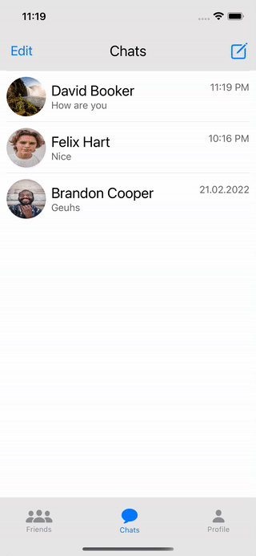

# MyChat_iOS

Telegram like chatting app with basic messaging and networking functions.

Developed by using SwiftUI

REGISTER: You can register with your mobile and personal info:

LOGIN:

You can login with another mobile number on same device.

PROFILE EDIT: You can update your personal info (except mobile) and photo any time you want.

FRIEND OPERATIONS:

You can add a friend by entering his/her mobile, and you can view his/her profile.

You can delete any friend by swiping or clicking on.

Your friends last seen info is updated as soon as s/he enter to or exit from the app.

CHAT OPERATIONS:

You can create a chat by clicking on a friend. Chat has the ability to get realtime updates whenever your friend sends a message.

You can delete any chat by swiping or clicking on.

